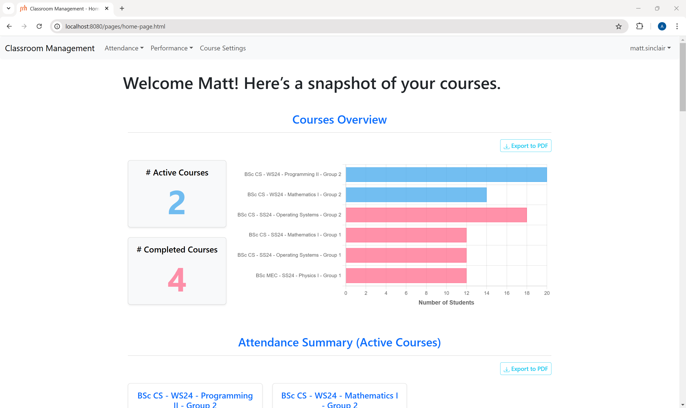
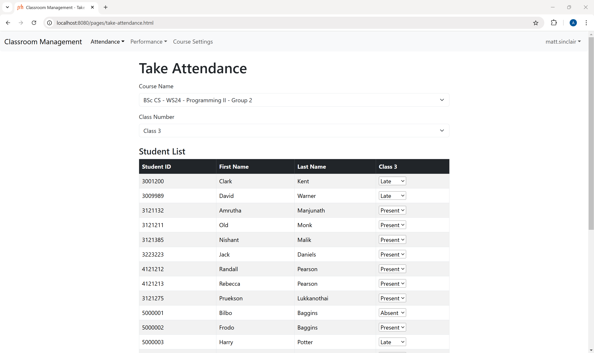
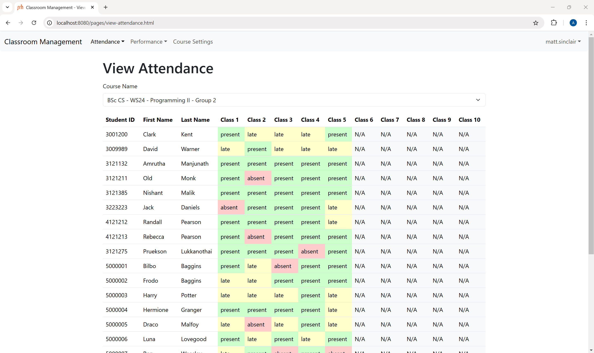
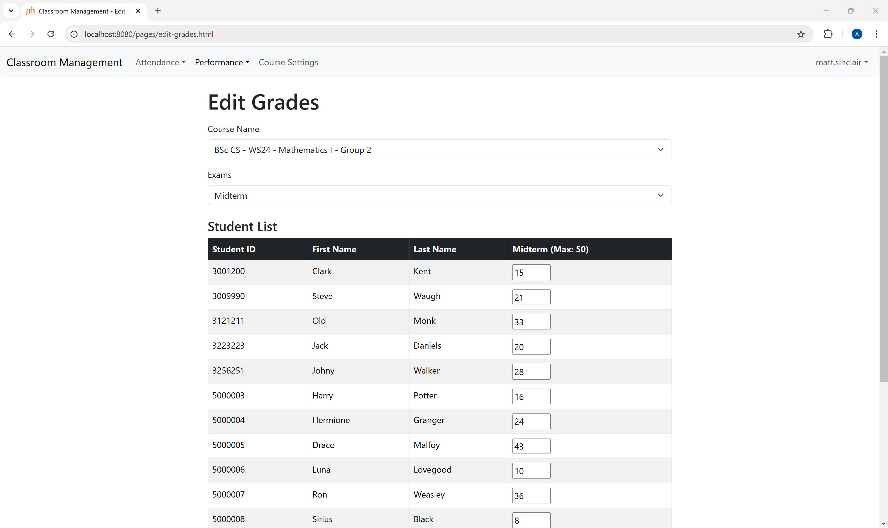
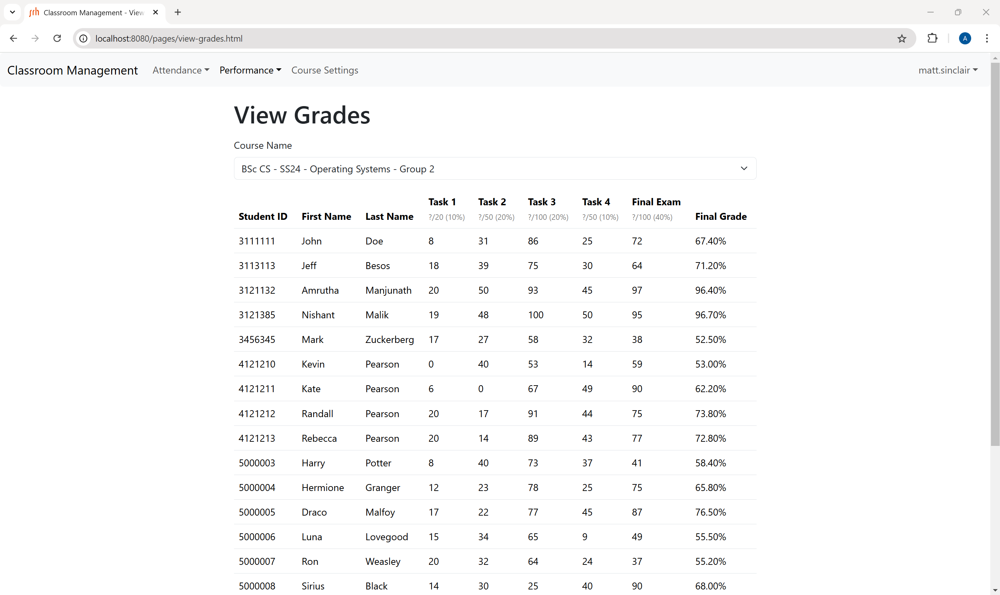
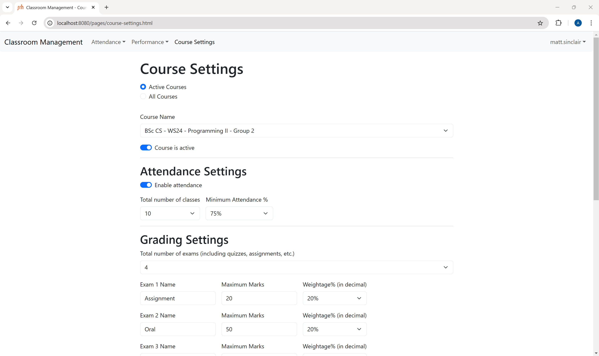
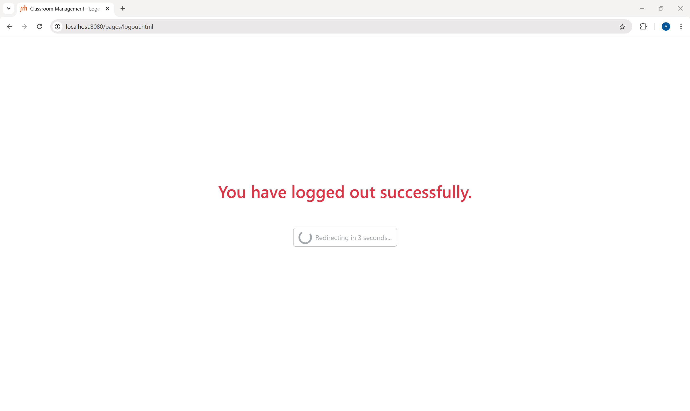
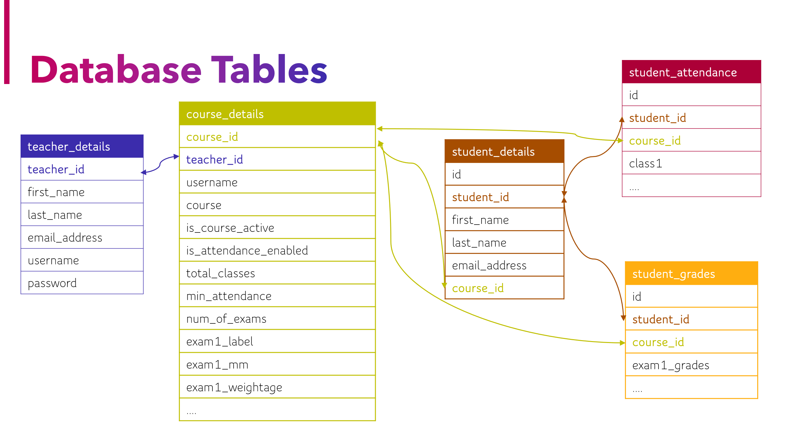

# Classroom Attendance and Performance Tracker
A web application for teachers to efficiently manage student attendance, track academic performance, and generate reports.
<br><br>

## Table of Contents
1. [Features](#1-features)
    - Attendance Management
    - Performance Tracking
    - Course Management
    - Reporting
2. [Screenshots](#2-screenshots)
3. [Technologies Used](#3-technologies-used)
    - Languages
    - Frameworks
    - Tools
4. [Getting Started](#4-getting-started)
5. [User Guide](#5-user-guide)
6. [Contributing](#6-contributing)
7. [License](#7-license)
8. [Contributors](#8-contributors)
<br><br>

## 1. Features
### 📚 Attendance Management
**Take Attendance**: Mark students as present, absent, or late for a particular class. If attendance data is populated in database, then drop-down label shows that value.  

**View Attendance**: Active & completed courses in sections in drop-down. Viewing attendance is for an entire course. Cells in display table have present, absent or late colour-coded values.  

### 📝 Performance Tracking
**Edit Grades**: Input grades for a particular exam. If grades data is populated in database, input field label shows that value. Oninput validation is used.  

**View Grades**: Viewing grades is for an entire course. Displays all the exams in a chosen course and calculated final grade in percentage.

### 🗂️ Course Management
Settings can be modified for active or all courses. A course can be toggled active or completed. Attendance can be enabled or disabled. Total number of classes and minimum attendance percentage is available.
Total number of exams, the name of each exam, maximum grades and weightage can be modified. Oninput validation is used.

### 📊 Reporting
**All Charts can be exported to PDF**  
Dashboard: Interactive Tooltip with Highlighting when hovering over a column (bar graph) or a section (pie chart).  

**Courses Overview**: Displays total number of active & completed courses. Bar graph for number of students in each course.   

**Attendance Summary (Active Courses)**: Shows the name of course, total number of students in each course, percentage of classes completed in each of active courses. Pie chart for percentage of students who were present, absent or late. Gives a list of students whose attendance is below minimum requirement.  

**Performance Summary**: (Active Courses) Bar graphs display all exams in each active course. Highest, lowest, average & median grades are shown.   
(Completed Courses) Bar graph shows number of students corresponding to score ranges in both percentage & German grading format.  
<br>
**All Views can exported to CSV**  
View Attendance & View Grades: Display table is converted to CSV file. CSV file is named according to selected course name.
<br><br>
## 2. Screenshots


















<br></br>

## 3. Technologies Used  
### 🖥️ Languages
- **HTML5 & CSS** 🌐 – For structuring and styling web pages.
- **JavaScript** ⚡ – For interactive client-side scripting.
- **Java 23** ☕ – Primary programming language.
- **CSV Files** 📄 – Used for initial data import.
- **MySQL Database** 🐬 – Relational database for storing data.
### 📦 Frameworks
- **Bootstrap** 🎨 – UI framework for responsive design.
- **Chart.js** 📊 – Library for data visualization.
- **jsPDF & HTML2Canvas** 📜 – For exporting PDFs from web content.
- **Spring Boot** 🌱 – Core framework for Java application.
- **Spring Data JPA** 🔗 – ORM framework for database interactions.
- **Hibernate** 🏛️ – JPA implementation for object-relational mapping.
- **Spring Web** 🌍 – For building RESTful APIs.
- **Spring Service Layer** 🏗️ – Handles business logic in the application.
### 🛠️ Tools
- **IntelliJ IDEA** 🏗️ – Main IDE for Java & Spring Boot development.
- **MySQL** 🐬 – Database management system.
- **Sublime Text** ✍️ – Lightweight text editor for HTML & CSS.
- **Visual Studio Code** 🖊️ – A versatile code editor for front-end development.
- **GitHub** 🔗 – Version control and project collaboration platform.
- **Notepad++** 📝 - Text editor for fast and easy modifications.
<br></br>

## 4. Getting Started
### 📌 Prerequisites
Ensure the following is installed
- Java 23
- IntelliJ IDEA
- MySQL
- Git
### 📥 Installation  
1️⃣ **Clone the Repository**  
- Open IntelliJ IDEA.
- Click on "Get from Version Control" on the welcome screen (or go to VCS > Get from Version Control in the top menu).
- Paste the repository URL:
```bash
https://github.com/nishant916/tracker.git
```
- Choose your local directory to clone the project into and click Clone.

- **Alternatively** open a terminal and run the following commands:
  
```bash
git clone https://github.com/nishant916/tracker.git
cd tracker
```
2️⃣ **Configure the Database**
- Open MySQL and create a new database:
```bash
CREATE DATABASE teacher_management;
```
- Update your application.properties file
```bash
spring.datasource.url=jdbc:mysql://localhost:3306/teacher_management
spring.datasource.username=root
spring.datasource.password=<yourpassword>
```
3️⃣ **Install Dependencies**
- Using Maven, open a terminal and run the following command from the root directory of the project:
```bash
mvn clean install
```
- This will download and install all the dependencies listed in the pom.xml file.

### 🚀 Running the Application
- Open the project in IntelliJ IDEA
- Navigate to TrackerApplication.java
- Click Run ▶️
- **Alternatively** open a terminal and run this command inside the project folder:
```bash
mvn spring-boot:run
```
- The application should now be running at `http://localhost:8080` 🎉
<br></br>
## 5. User Guide
### 🗝️ Login
- Teachers must log in using their username and password.
- These credentials are provided by the admin.
- Click "Sign in" to access the teacher dashboard.

### 🏠 Teacher Dashboard
- Navbar for ease of navigation has appeared.
- Teachers can click on the "Export to PDF" button on the top right of every chart.
- The chart will be downloaded as a PDF.

### ✅ Take Attendance
- Select an active course & then select a class number from drop-downs.
- A table will appear with student details and the class column with a drop-down for present/absent/late marking.
- Click on "Save Changes".

### 📅 View Attendance
- Select an active or completed course from the drop-down.
- A table will appear with student details and colour-coded present/absent/late values for all classes in the course.
- Click on "Export to CSV" to get details into Excel.

### ✏️ Edit Grades
- Select an active course & then select an exam number from drop-downs.
- A table will appear with student details and the exam column with an input field.
- Enter the grades & click on "Save Changes".
  
### 📈 View Grades
- Select an active or completed course from the drop-down.
- A table will appear with student details, all exam grades in the course & calculated final grade.
- Click on "Export to CSV" to get details into Excel.

### ⚙️ Course Settings
- **Course Settings**: Choose active or all courses from drop-down. A course can be toggled active or completed.
- **Attendance Settings**: Attendance can be toggled enabled or disabled, total number of classes for a course chosen from drop-down (max = 10) & minimum percentage required chosen (from 50% to 100% or "no min attendance").
- **Grade Settings**: Total number of exams chosen from drop-down (max = 10), input exam names, input maximum marks & choose weightage (from 0% to 100%).
- Click on "Save Changes".

### 🚪 Logout
- Hover over teacher's username on top-right corner of navbar.
- Click on "Logout".
- Teacher will be redirected to Login Page in 5 seconds.
<br></br>
## 6. Contributing
We welcome contributions! To get started:
### 🍴 Fork & Clone
Click on the Fork button at the top-right of the repository page. Open IntelliJ IDEA. Click "Get from Version Control", enter:
```bash
https://github.com/<github-username>/tracker.git
```
### 🌿 Create a Branch
Go to Git > Branches > New Branch, name it appropriately.
### ✏️ Make Changes & Commit
Modify the code and commit via IntelliJ’s Git tool window.
### 🚀 Push & Open a PR
Push changes (VCS > Git > Push) and submit a Pull Request on GitHub.
### 💡 Found a bug?
Open an issue in the Issues tab.
<br></br>
## 7. License
This project was developed as part of a university programming course and is intended for educational purposes only.
- Usage: You may review and learn from the code.
- Restrictions: Redistribution, commercial use, or modification for external projects may require permission.
- Ownership: The work belongs to the project contributors and the university course.
<br></br>
## 8. Contributors
This project was developed as part of the **Programming II course in the BSc Computer Science degree at SRH Berlin University**.
### 🤝 Project Team:
- Nishant Malik
- Amrutha Manjunath
- Pruekson Lukkanothai
  


